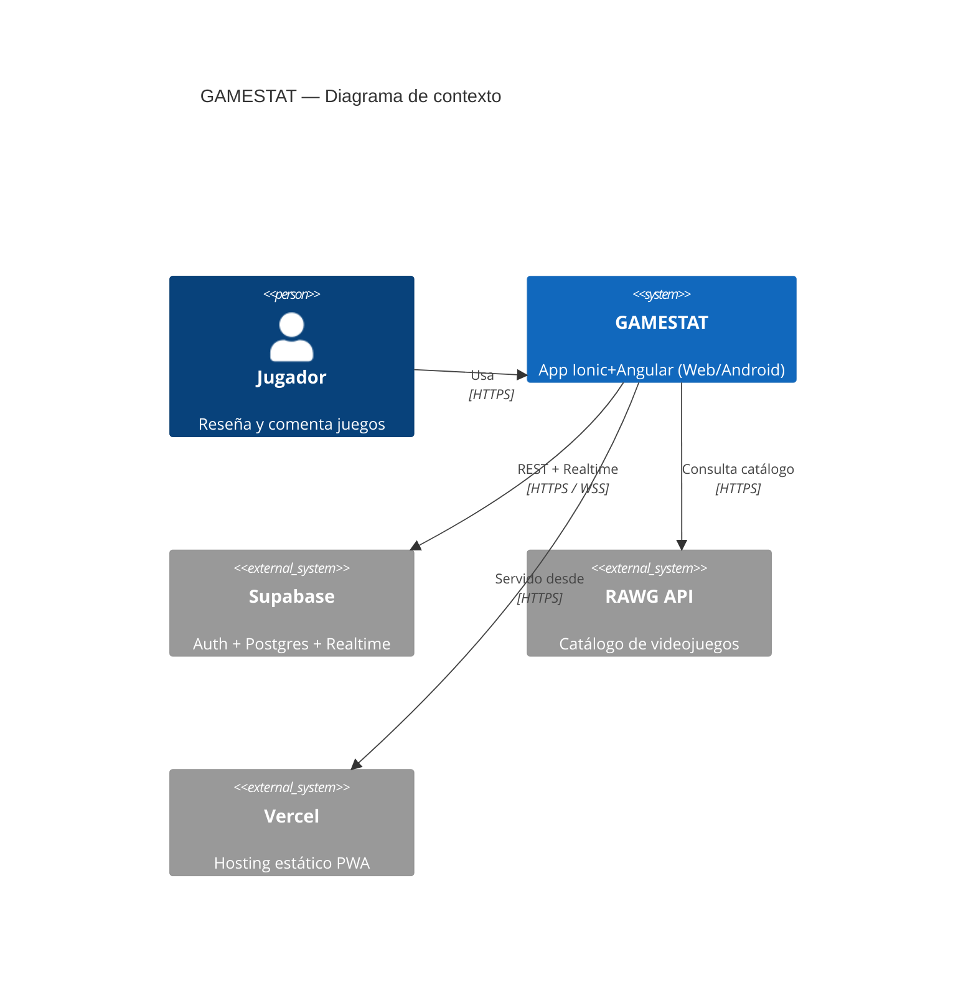
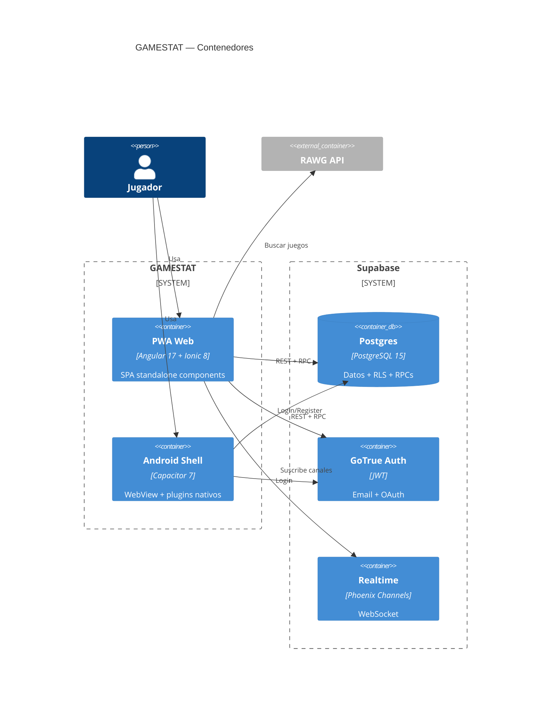
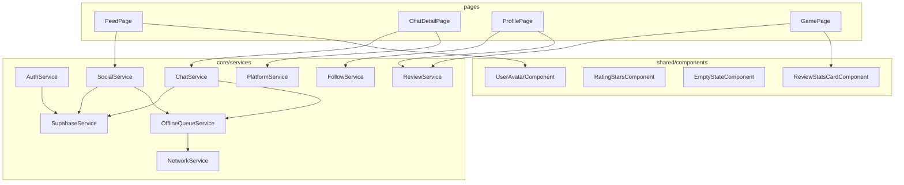

# Arquitectura — GAMESTAT

## 1. Visión general

GAMESTAT es una red social ligera para reseñar y comentar videojuegos. La aplicación se distribuye como **PWA Ionic + Angular** desplegada en Vercel y como **APK Android** generada con Capacitor. El backend es **Supabase** (Postgres + Auth + Realtime + Storage) sin servidor propio.

## 2. Contexto (C4 nivel 1)



## 3. Contenedores (C4 nivel 2)



## 4. Componentes Angular (C4 nivel 3, vista parcial)



## 5. Decisiones técnicas

| Decisión | Alternativa descartada | Justificación |
| --- | --- | --- |
| Supabase (BaaS) | NestJS + Postgres propio | Reducir mantenimiento; Auth + RLS + Realtime listos. |
| Angular Signals | RxJS para estado UI | Menos boilerplate, integración nativa Angular 17, sin zonas extra. |
| Standalone components | NgModules | Tree-shaking más agresivo, recomendación oficial Angular. |
| Capacitor 7 | Cordova / React Native | Reutilizar 100% el código web; plugins JS/TS modernos. |
| Vercel | Netlify / GitHub Pages | Despliegues atómicos por commit y previews por PR. |
| Karma + Jasmine | Vitest / Jest | Es el runner por defecto de Angular CLI; cero config extra. |

## 6. Flujos clave

- **Login**: `LoginPage` → `AuthService.login` → `supabase.auth.signInWithPassword` → emite `currentUser` signal → router redirige a `/tabs/feed`.
- **Publicar post**: `FeedPage.publishPost` → `SocialService.createPost` → si online: insert vía RPC; si offline: enqueue en `OfflineQueueService` → flush al volver `online`.
- **Like optimista**: `SocialService.toggleLike` aplica el cambio en UI, llama a `toggle_post_like` (RPC atómica), reconcilia con el valor autoritativo o hace rollback si error.
- **Chat realtime**: `ChatService` se suscribe a postgres_changes en `messages` y presence para "escribiendo…".

## 7. Carpetas

```
src/app/
  core/     # servicios + guardas + modelos compartidos
  shared/   # componentes/pipes reutilizables
  pages/    # rutas (standalone components)
supabase/   # esquema + RLS + RPCs (.sql)
docs/       # documentación TFG
```
