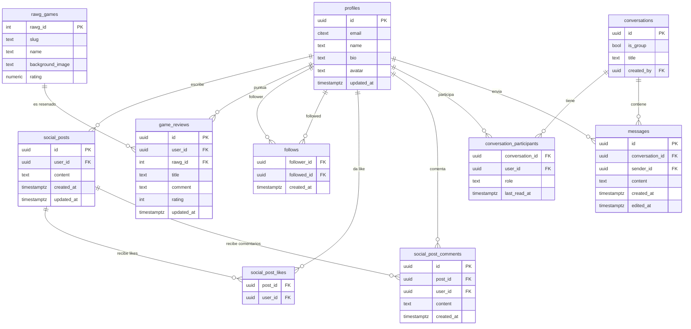

# Modelo de datos — GAMESTAT

Backend: **PostgreSQL gestionado por Supabase**. Toda escritura está protegida por RLS y la mayoría de operaciones cruzadas se encapsulan en funciones SQL (RPCs) con `SECURITY DEFINER` para evitar fugas de datos.

## 1. Diagrama entidad-relación

## 2. Tablas

| Tabla | Propósito | RLS |
| --- | --- | --- |
| `profiles` | Perfil público de cada usuario (linkeado a `auth.users`). | SELECT público; UPDATE solo dueño. |
| `follows` | Relaciones follower→followed. | SELECT público; INSERT/DELETE solo follower. |
| `rawg_games` | Caché local de juegos de RAWG. | SELECT autenticado; UPSERT autenticado; sin DELETE. |
| `game_reviews` | Reseñas con rating 1-10 y comentario. | SELECT público; INSERT/UPDATE/DELETE solo autor. UNIQUE `(user_id, rawg_id)`. |
| `social_posts` | Posts del feed con texto libre. | SELECT público; INSERT/UPDATE/DELETE solo autor. |
| `social_post_likes` | Like atómico (PK compuesta). | SELECT público; INSERT/DELETE solo dueño. |
| `social_post_comments` | Comentarios en posts. | SELECT público; INSERT solo authenticated; UPDATE/DELETE solo autor. |
| `conversations` | Chats 1-a-1 y grupos. | SELECT/UPDATE solo participantes. |
| `conversation_participants` | Membresía + rol (`member`/`admin`) + `last_read_at`. | SELECT participantes; INSERT por RPCs admin. |
| `messages` | Mensajes con `edited_at`. | SELECT participantes; INSERT solo sender; UPDATE solo autor (24 h). |

## 3. RPCs (resumen)

| RPC | Descripción |
| --- | --- |
| `search_profiles(q, limit)` | Búsqueda fuzzy con trigram + ranking. |
| `is_following(target)` | Devuelve `bool`. |
| `get_follow_counts(target)` | Followers + following en una sola query. |
| `list_followers / list_following(target, limit, offset)` | Paginación. |
| `get_review_stats(rawg_id)` | Distribución 1-10 + media + total. |
| `get_user_review_stats(user_id)` | Reseñas por usuario. |
| `toggle_post_like(p_post)` | Toggle atómico like; devuelve `(liked, likes_count)`. |
| `get_user_feed(p_before, p_limit)` | Feed por cursor (timestamp). |
| `get_user_conversations()` | Lista de chats con unread + last_message + otro participante. |
| `get_conversation_messages(conv, before_ts, page_limit)` | Paginación hacia atrás. |
| `mark_conversation_read(conv)` | Actualiza `last_read_at`. |
| `add_group_member / remove_group_member / promote_group_member(conv, user)` | Solo admin. |

## 4. Realtime

Canales suscritos:

- `postgres_changes` en `messages` (INSERT/UPDATE) por conversación.
- `postgres_changes` en `social_posts`, `social_post_likes`, `social_post_comments`.
- `postgres_changes` en `follows` filtrado por `follower_id = me`.
- `presence` en cada conversación para indicador de "escribiendo…".

## 5. Índices destacados

- `profiles.name` trigram (GIN) para fuzzy search.
- `messages (conversation_id, created_at DESC)` para paginar mensajes.
- `social_posts (created_at DESC)` para feed cronológico.
- `follows (follower_id)` y `follows (followed_id)`.
- `game_reviews (rawg_id)` y `(user_id, rawg_id)` UNIQUE.

## 6. Scripts SQL

Orden de ejecución en Supabase SQL Editor (ver `supabase/README.md`):

1. `00_extensions.sql`
2. `_shared.sql`
3. `profiles.sql`
4. `follows.sql`
5. `rawg_games.sql`
6. `game_reviews.sql`
7. `social_posts.sql`
8. `chat.sql`
9. `realtime.sql`
10. (opcional) `seed_demo.sql`
