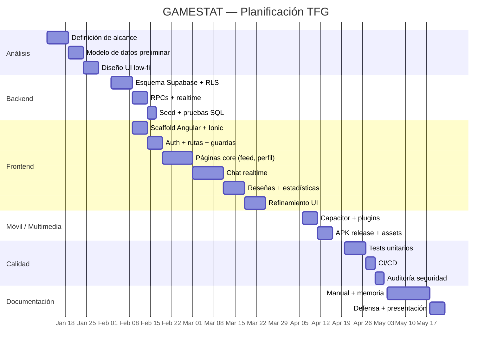

# Cronograma — GAMESTAT

## 1. Gantt

## 2. Hitos

| Hito | Fecha objetivo | Estado |
| --- | --- | --- |
| Esquema BBDD estable | Sem. 6 | Hecho |
| Auth + Feed funcional | Sem. 8 | Hecho |
| Chat en tiempo real | Sem. 11 | Hecho |
| Offline support | Sem. 13 | Hecho |
| APK release | Sem. 15 | En curso |
| Cobertura tests ≥ 70% | Sem. 17 | En curso |
| Memoria + defensa | Sem. 19 | Pendiente |

## 3. Horas estimadas vs reales (aprox.)

| Bloque | Estimadas | Reales |
| --- | --- | --- |
| 1 — Datos | 40 | 45 |
| 2 — UI | 60 | 70 |
| 3 — Sociales | 40 | 50 |
| 4 — Servicios / chat | 50 | 60 |
| 5 — Seguridad + CI/CD + tests | 35 | 40 |
| 6 — Capacitor / Android | 25 | 25 |
| 7 — Documentación | 25 | 20 |
| **Total** | **275** | **310** |

Desviación principal en bloque 4 (chat realtime + offline queue) por refactor a RPCs y depuración de la cola persistente.
